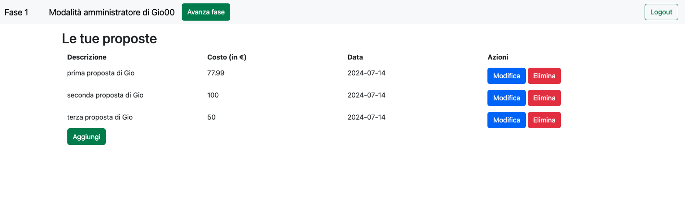
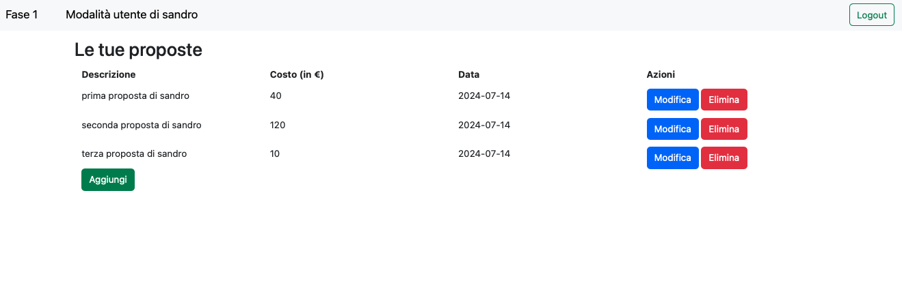
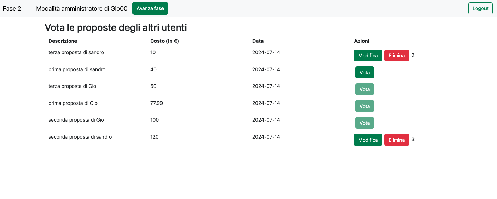
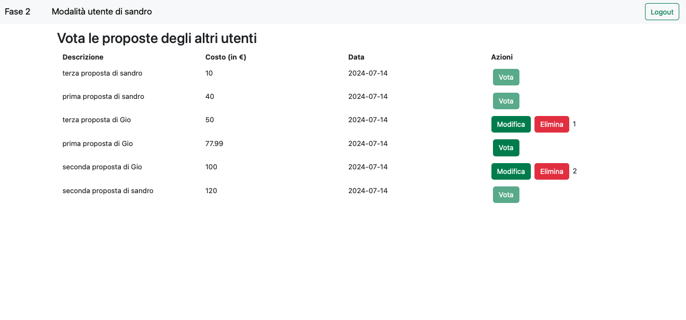

[](https://classroom.github.com/a/OLXYiqlj)
# Exam #2: "Budget sociale"
## Student: s324286 Tagliaferri Giovanni 

## React Client Application Routes

- Route `/`: it is the first page of the app and it shows the Login page if the user is not logged in and the 'ospiteMod' is not selected, otherwise it shows the user console page. The login page allows a user to login with its credentials or to enter in guest mode, while the user console's content changes according to the current phase and the type of user:

  - Phase 0: for 'amministratore' it shows a button to redirect to `/addBudget`, for other users it shows that the definition phase is still ongoing;
  - Phase 1: for logged users it shows a page to add and visualize their own 'proposte';
  - Phase 2: for logged users show a page to vote other users' 'proposte';
  - Phase 3: for every type of user shows a table with the approved 'proposte' and, if they are logged in, also the not approved ones.

- Route `/addBudget`: shows the form to define the budget if the user is logged in and it's an 'amministratore', otherwise it shows an error message and a button to go back to the home page.

- Route `/addProposta`: shows a form where a logged user can create a 'proposta' by providing its description, cost (less than the budget otherwise it generates an error), date (by default it's the current date but it can be changed).

- Route `/editProposta/:idProposta`: shows a form where a logged user can modify an own 'proposta' whose id is provided as param. The form is filled with the previous data and they can be changed.

- Route `/login`: a user can enter its credentials (username and password) and, if they are correct, can log in the application. It is also provided the possibility to enter as guest by clicking on the apposite button.

- Route `*`: every non-existent path is redirected to this page that shows an error message and a button to go back to the `/`route.

## API Server

### __Create budget__

URL: `/api/budget`

HTTP Method: POST.

Description: creation of the budget by an 'amministratore'.

Request body:
```
{
  "id": 1,
  "valore": 200
}
```

Response: `201 created` (success, budget created with success), `401 unauthorized` (user not 'amministratore'), `422 unprocessable entity` (validation error), `500 internal server error` (generic error), `503 service unavailable` (budget already existing).

Response body: __None__

### __Get budget__

URL: `/api/budget`

HTTP Method: GET.

Description: get the budget's value.

Request body: __None__

Response: `200 ok` (success), `500 internal server error` (generic error), `503 service unavailable` (budget not found).

Response body:
```
{
  "id": 1,
  "valore": 200
}
```

### Delete budget

URL: `/api/budget`

HTTP Method: DELETE.

Description: after the phase 3 the 'amministratore' deletes the budget.

Request body: __None__

Response: `200 ok` (success), `401 unauthorized` (user not 'amministratore'), `500 internal server error` (generic error).

Response body: __None__

### __Create phase__

URL: `/api/fase`

HTTP Method: POST.

Description: initialize the value of the phase to 0 when a logged user first starts the application.

Request body: __None__

Response: `201 created` (phase created with success), `401 unauthenticated` (user not authenticated), `422 unprocessable entity` (validation error), `500 internal server error` (generic error), `503 service unavailable` (phase already existing).

Response body: __None__

### __Get phase__

URL: `/api/fase`

HTTP Method: GET.

Description: get the current value of the phase (0, 1, 2 or 3).

Request body: __None__

Response: `200 ok` (success), `500 internal server error` (generic error), `503 service unavailable` (phase not found).

Response body:
```
{
  "id": 1
  "valore": 0
}
```

### __Change phase__

URL: `/api/fase`

HTTP Method: PUT.

Description: change the current value of the phase.

Request body:
```
{
  "id": 1
  "valore": 1
}
```

Response: `200 ok` (success), `401 unauthorized` (user not 'amministratore'), `422 unprocessable entity` (validation error), `500 internal server error` (generic error).

Response body: __None__

### __Delete phase__

URL: `/api/fase`

HTTP Method: DELETE.

Description: delete phase value when restarting the application.

Request body: __None__

Response: `200 ok` (success), `401 unathorized` (user not 'amministratore'), `500 internal server error` (generic error).

Response body: __None__

### __Create 'proposta'__

URL: `/api/proposte`

HTTP Method: POST.

Description: a logged user create a new 'proposta'.

Request body:
```
{
  "id": 1,
  "descrizione": "prima proposta di Giovanni",
  "costo": 150,
  "data": 2024-07-03,
  "idUtente": 1,
  "approvata": "false",
  "punteggio": 0
}
```

Response: `201 created` ('proposta' created with success), `401 unauthenticated` (user not authenticated), `422 unprocessable entity` (validation error), `503 service unavailable` (generic error).

Response body: __None__

### __Get one 'proposta'__

URL: `/api/proposte/<id>`

HTTP Method: GET.

Description: get one 'proposta' by id.

Request body: __None__

Response: `200 ok` (success), `404 not found` (id not found), `500 internal server error` (generic error).

Response body:
```
{
  "id": 1,
  "descrizione": "prima proposta di Giovanni",
  "costo": 150,
  "data": 2024-07-03,
  "idUtente": 1,
  "approvata": "false",
  "punteggio": 0
}
```

### __Get list of 'proposte'__

URL: `/api/proposte`

HTTP Method: GET.

Request body: __None__

Description: get the complete list of 'proposte'.

Response: `200 ok` (success), `500 internal server error` (generic error).

Response body:
```
[
  {
    "id": 1,
    "descrizione": "prima proposta di Giovanni",
    "costo": 150,
    "data": 2024-07-03,
    "idUtente": 1,
    "approvata": "false",
    "punteggio": 0
  },
  {
    "id": 2,
    "descrizione": "prima proposta di Sandro",
    "costo": 50,
    "data": 2024-07-02,
    "idUtente": 2,
    "approvata": "false",
    "punteggio": 0
  },
  ...
]
```

### __Get list of 'proposte' of a given user__

URL: `/api/utenti/<id>/proposte`

HTTP Method: GET.

Request body: __None__

Description: get the list of 'proposte' of a given user.

Response: `200 ok` (success), `401 unauthorized` (user not authorized), `404 not found` (id not found), `500 internal server error` (generic error).

Response body:
```
[
  {
    "id": 1,
    "descrizione": "prima proposta di Giovanni",
    "costo": 150,
    "data": 2024-07-03,
    "idUtente": 1,
    "approvata": false,
    "punteggio": 0
  },
  {
    "id": 2,
    "descrizione": "seconda proposta di Giovanni",
    "costo": 50,
    "data": 2024-07-02,
    "idUtente": 1,
    "approvata": "false",
    "punteggio": 0
  },
  ...
]
```

### __Edit one 'proposta'__

URL: `/api/proposte/<id>/`

HTTP Method: PUT.

Description: change a 'proposta' details after its user modifies it (also includes the approvation of it).

Request body:
```
{
  "id": 1,
  "descrizione": "modifica testo proposta di Giovanni",
  "costo": 200,
  "data": 2024-07-07,
  "idUtente": 1,
  "approvata": "false",
  "punteggio": 0
},
```

Response: `200 ok` (success), `401 unauthorized` (user not authorized), `404 not found` (id not found), `500 internal server error` (generic error).

Response body: __None__

### __Delete one 'proposta'__

URL: `/api/proposte/<id>`

HTTP Method: DELETE.

Description: delete one 'proposta' identified by id.

Request body: __None__

Response: `200 ok` (success), `401 unauthorized` (user not authorized), `404 not found` (id not found), `500 internal server error` (generic error).

Response: __None__

### __Delete all 'proposte'

URL: `/api/proposte/`

HTTP Method: DELETE.

Description: delete all 'proposte'.

Request body: __None__

Response: `200 ok` (success), `401 unauthorized` (user not 'amministratore'), `500 internal server error` (generic error).

Response: __None__

### __Create one 'preferenza'__

URL: `/api/proposte/<id>/preferenze`

HTTP Method: POST.

Description: a user express one 'preferenza' for a 'proposta' identified by id specifying the value that can be 1,2 or 3.

Request body:
```
{
  "id": 1,
  "idUtente": 1,
  "idProposta": 2,
  "valore": 3
}
```

Response: `201 created` ('preferenza' created with success), `401 unauthenticated` (user not authenticated), `404 not found` (id not found), `422 unprocessable entity` (validation error), `500 internal server error` (generic error), `503 service unavailable` ('preferenza' already existing).

Response body: __None__

### __Delete one 'preferenza'__

URL: `/api/proposte/<id>/preferenze`

HTTP Method: DELETE.

Description: a user deletes one of his 'preferenza' put to a 'proposta' given the 'proposta's id.

Request body: __None__

Response: `200 ok` (success), `401 unauthenticated` (user not authenticated), `404 not found` (id not found), `500 internal server error` (generic error), `503 service unavailable` ('prefernenza' not existing).

Response body: __None__

### __Edit 'preferenza' value__

URL: `/api/proposte/<id>/preferenze`

HTTP Method: PUT.

Description: change the field 'valore' of an existing 'preferenza'.

Request body:
```
{
  "id": 1,
  "idProposta": 1,
  "idUtente": 2,
  "valore": 3
}
```
Response: `200 ok`(success), `401 unauthenticated` (user not authenticated), `404 not found` (id 'proposta' not found), `500 internal server error` (generic error), `503 service unavailable` ('preferenza' not existing).

Response body: __None__


### __Get all 'preferenze' for a 'proposta'__

URL: `/api/proposte/<id>/preferenze`

HTTP Method: GET.

Description: get all 'preferenze' for a 'proposta' given its id.

Request body: __None__

Response: `200 ok`, `401 unauthorized` (user not authorized), `404 not found` (id not found), `500 internal server error` (generic error).

Response body: __None__

### __Get all 'preferenze'__

URL: `/api/preferenze`

HTTP Method: GET.

Description: get complete list of 'preferenze' of all 'proposte' and 'utenti'.

Request body: __None__

Response: `200 ok` (success), `500 internal server error` (generic error).

Response body:
```
[
  {
    "id": 1,
    "idUtente": 1,
    "idProposta": 2,
    "valore": 3
  },
  {
    "id": 2,
    "idUtente": 2,
    "idProposta": 3,
    "valore": 1
  },
  ...
]
```

### __Delete all 'preferenze'__

URL: `/api/preferenze`

HTTP Method: DELETE.

Request body: __None__

Response: `200 ok` (success), `401 unauthorized` (user not 'amministratore'), `500 internal server error` (generic error).

Response body: __None__

### __Login__

URL: `/api/sessioni`

HTTP Method: POST.

Description: authenticates the user given his username and password.

Request body:
```
{
  "username": Giovanni,
  "password": password
}
```

Response: `200 ok` (success), `401 unauthorized` (user not authorized), `500 internal server error` (generic error).

Response body:
```
{
  "id": 1,
  "username": username,
  "ruolo": "utente
}
```

### __Check user logged in__

URL: `/api/sessioni/corrente`

HTTP Method: GET.

Description: check if the user is still logged in and get the data.

Request body: __None__

Response: `200 ok` (success), `401 unauthorized` (user not authorized), `500 internal server error` (generic error).

Response body:
```
{
  "id": 1,
  "nome": Giovanni,
  "cognome": "Tagliaferri",
  "email": "giovanni@polito.it",
  "username": "Giovyears",
}
```

### __Logout__

URL: `/api/sessioni/corrente`

HTTP Method: DELETE.

Description: ends the current session.

Request body: __None__

Response: `200 ok` (success), `401 unauthorized` (user not authorized) `500 internal server error` (generic error).

Response body: __None__

### __Get list of usernames__

URL: `/api/utenti`

HTTP Method: GET.

Description: get the complete ids and usernames list of the 'utenti' who signed up in the application.

Request body: __None__

Response: `200 ok` (success), `500 internal server error` (generic error).

Response body:
```
[
  {
    "id": 1,
    "username": "Giovyears"
  },
  {
    "id": 2,
    "username": "Sandro"
  },
  ...
]
```


## Database Tables

- Table `fase` - contains id and valore
- Table `budget`- contains id and valore
- Table `utente` - contains id, nome, cognome, email, username, ruolo, hash, salt
- Table `proposta` - contains id, descrizione, costo, data, idUtente, approvata, punteggio
- Table `preferenza` - contains id, idProposta, idUtente, valore

## Main React Components

- `FormBudget` (in `FormBudgetComponent.jsx`): shows the form to define the next year budget by defining a value that's not less than 100€.

- `FormProposta` (in `FormPropostaComponent.jsx`): shows the form to both add or edit a 'proposta' by providing 'descrizione, costo, data' and the buttons 'Aggiungi' to create a new 'proposta', 'Modifica' to edit an existing one, 'Annulla' to abort the operation.

- `LoginForm` (in `LoginComponent.jsx`): shows the form to enter the user's credential (username and password) and perform the login if they are correct by pressing the "Login" button, otherwise to enter the application in guest mode by pressing "Entra come ospite".

- `NavHeader` (in `NavHeaderComponent.jsx`): shows the navigation bar on top of the screen in every page in which can be found: the current phase number, the mode according to the type of user, the button to login or logout and, only for 'amministratore', the button to advance phase and reset the database.

- `ProposteTabella` (in `ProposteComponent.jsx`): shows the table of 'proposte' according to the current phase, in particular:

  - phase 1: only the user's 'proposte' to manage them
  - phase 2: all 'proposte' to vote them
  - phase 3: approved 'proposte' and not (for guests only approved ones).


## Screenshot

Fase 1 amministratore


Fase 1 utente


Fase 2 amministratore


Fase 2 utente


## Users Credentials

| Username   | Plain-text Password |
|------------|---------------------|
| Gio00      | passwordGIO00       |
| sandro     | SANdro96            |
| matt00     | mattia2024          |
| MarioRossi | marioPASS24         |
